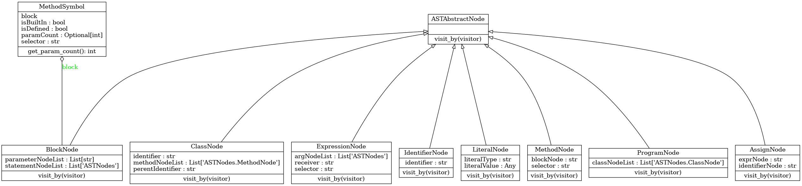
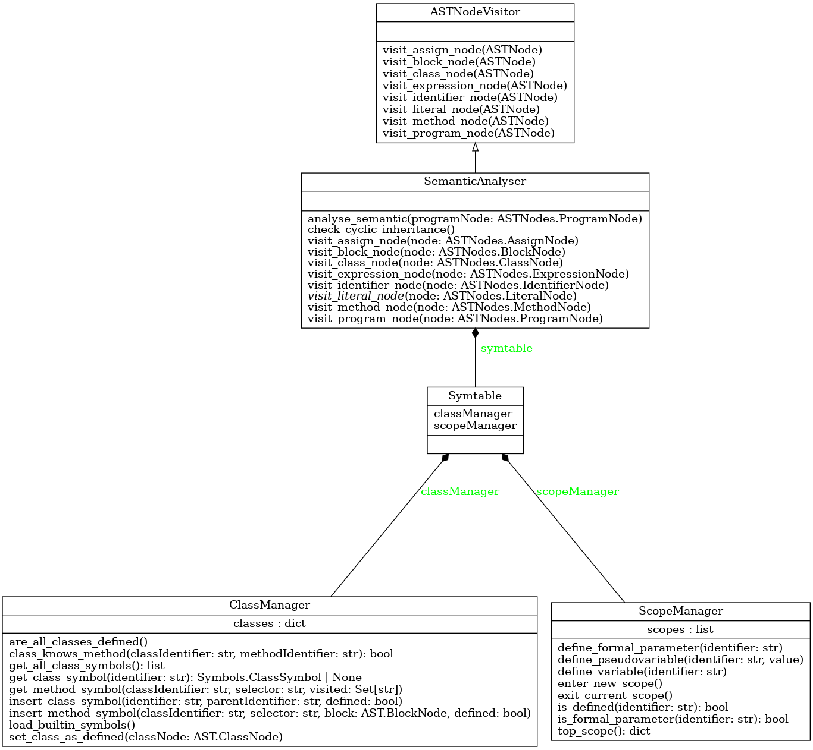

# Implementační dokumentace k 1. úloze do IPP 2024/2025 

**Jméno a příjmení:** Jan Kalina\
**Login:** `xkalinj00`

## Architektura a obecné shrnutí objektově orientovaného návrhu 

Snažil jsem se program **`parse.py`** navrhnout tak, aby byl modulárně a
**objektově-orientovaně** rozdělen do několika částí. Hlavní skript
`parse.py` slouží jako vstupní bod – načítá zdrojový kód jazyka SOL25
ze standardního vstupu, zpracuje argumenty příkazové řádky a spouští
analýzu kódu. Samotná logika analýzy je však rozdělena do
specializovaných tříd v mém balíčku `MyPyModules`. Každá část zpracování
má svou komponentu: syntaktickou a lexikální analýzu zajišťuje třída
`LarkParser`, sémantickou analýzu třída `SemanticAnalyser` a generování
výstupu ve formátu XML třída `XMLGenerator`. Toto rozdělení odpovídá
principu **jednotné odpovědnosti** – každá třída má jasně vymezenou
funkci a výrazně usnadňuje testování i údržbu. Díky objektovému návrhu
mohou tyto komponenty spolupracovat prostřednictvím definovaných
rozhraní.

## Stručně o průběhu programu

Po spuštění skriptu se nejdříve zavolá `ArgumentParser` pro validaci
přepínačů – k validaci jsou využity třídy a metody z modulu
**`argparse`**, díky němuž lze nejen kontrolovat validitu argumentů, ale
také nadefinovat nápovědu k programu. Následně se načte zdrojový kód a
vytvoří se instance třídy `Facade` (viz
[Využití návrhového vzoru Fasáda](#vyuziti-navrhoveho-vzoru-fasada)) a zavolá
se metoda `run_analysis()`, která postupně provede celý průběh
parsování, sémantické kontroly a generování XML.

Lexikální a syntaktická analýza probíhá uvnitř modulu `LarkParser` a
využívá třídy modulu **`lark`**. Vstupní gramatikou pro **`lark`** je
zadaná LL gramatikou převedena na regulární výrazy. Vedle pravidel
definuji například také klíčová slova a regulární výrazy pro
identifikátory, selektory, číselné hodnoty či řetězcové literály.
Výstupem je tzv. *parse tree*, který pomocí **`lark`** třídy
`Transformer` transformuji na mnou definovaný abstraktní syntaktický
strom, *AST* (viz [Reprezentace AST a návrhový vzor Visitor](#reprezentace-ast-a-navrhov-vzor-visitor)). Platí, že
pro každé gramatické pravidlo a každý definovaný terminál je nutné
vytvořit v rámci transformace vlastní transformační metodu.

V této chvíli přebírá řízení objekt `SemanticAnalyser`, který dědí z
třídy `ASTNodeVisitor` a umí rekurzivně procházet AST pomocí metody
`visit_by(visitor)`. Sémantický analyzátor využívá modul `Symtable.py`,
který definuje třídu pro tabulka symbolů rozdělenou na dvě podtřídy
`ClassManager` k uchování definic tříd (`ClassSymbol`) a jejich metod
(`MethodSymbol`) a `ScopeManager`, který je zodpovědný za správu
lexikálních rámců během sémantické analýzy. Podtřída `ClassManager`
kontroluje platnost tříd a jejich metod včetně těch *„vestavěných"*. Při
objevení zadáním definované sémantické chyby dochází k vyhození mé
vlastní specializované výjimky děděné z třídy pro obecnou výjimku uvnitř
`CustomErrors.py` (stejně jako v ostatních modulech programu) a její
následné propagaci zpět do skriptu `parse.py` (viz
[Další prvky dědičnosti v návrhu](#dalsi-prvky-dedicitosti-v-navrhu)).

Jestliže sémantické kontroly proběhnou úspěšně, přechází se ke
generování výstupního XML (viz
[Generování XML výstupu](#generovani-xml-vystupu)).

## Využití návrhového vzoru *Fasáda*

V souboru `parse.py` je implementována třída `Facade`, inspirovaná
návrhovým vzorem *fasáda*. Jejím úkolem je poskytnout jednotné rozhraní
pro celý proces analýzy zdrojového kódu. Třída `Facade` zapouzdřuje
vytvoření a použití výše zmíněných komponent analyzátoru: v konstruktoru
si připraví instanci třídy `LarkParser`, `SemanticAnalyser` a
`XMLGenerator`. Navenek pak nabízí jednoduchou metodu `run_analysis()`,
která postupně provede všechny fáze analýzy – od parsování kódu, přes
sémantickou analýzu, až po generování a výpis výstupního XML. Hlavní
funkce skriptu tak může analyzovat kód jediným voláním
`facade.run_analysis()`, aniž by se starala o detaily implementace
jednotlivých kroků. Přínosem tohoto přístupu je menší provázanost
komponent – změny v interní logice (například úprava formátu XML nebo
vylepšení kontroly) nevyžadují úpravy v kódu, který fasádu využívá –
fasáda tak zlepšuje **udržovatelnost** a srozumitelnost celého projektu,
protože odděluje (analýza kódu) od .

## Reprezentace AST a návrhový vzor *Visitor*

Po syntaktickém zpracování vstupního kódu generuje parser abstraktní
syntaktický strom (AST) složený z objektů představujících konstrukce
jazyka (uzly pro program, třídy, metody, bloky, literály, proměnné
atd.). Pro průchod tímto stromem a provedení sémantické analýzy byl
použit návrhový vzor ***Visitor***. V projektu je definováno rozhraní
návštěvníka jako abstraktní třída `ASTNodeVisitor`. Tato třída deklaruje
metody jako `visit_program_node()`, `visit_class_node()`,
`visit_method_node()` a další pro každý typ uzlu v AST. **Dědičnost** a
**překrývání (override)** zde hrají klíčovou roli – třída
`ASTNodeVisitor` poskytuje výchozí (prázdné) implementace návštěvníků,
které vyvolají chybu, pokud nejsou překryty, a konkrétní návštěvníky pro
sémantickou analýzu. Třída `SemanticAnalyser` z třídy `ASTNodeVisitor`
**dědí**.

`SemanticAnalyser` tak **překrývá** všechny potřebné metody
`visit_*_node` vlastní implementací kontrol sémantiky. Například
implementuje `visit_class_node(self, node)`, kde ověřuje pravidla pro
třídy, a podobně `visit_method_node`, `visit_expression_node` atd., pro
kontrolu správnosti definic metod, výrazů či přiřazení.

Každá třída uzlu (např. `ProgramNode`, `ClassNode`, `BlockNode`, ...)
dědí ze společné abstraktní třídy (v kódu označené jako
`ASTAbstractNode`) a definuje metodu `visit_by(self, visitor)`. Tato
metoda zavolá odpovídající funkci návštěvníka – například
`ProgramNode.visit_by()` interně volá
`visitor.visit_program_node(self)`. **Polymorfismus** zde umožňuje, že
volání `someNode.visit_by(analyser)` automaticky vybere správnou
implementaci podle typu `someNode` (program, třída, výraz, ...), aniž by
analýza musela ručně zjišťovat typ uzlu.

Využití návrhového vzoru *Visitor* výrazně přispívá k **oddělení
logiky** od datové části. AST uzly pouze nesou data (např. seznam metod,
jméno třídy atd.), ale neřeší, jaké kontroly se nad nimi provádějí – to
je úlohou návštěvníka.

## Další prvky dědičnosti v návrhu

Návrh využívá dědičnost i mimo samotný vzor *Visitor*. Všechny třídy
uzlů AST sdílejí společného předka (`ASTAbstractNode`), což zajišťuje
konzistentní rozhraní (`visit_by()`) pro průchod stromem a případně
možnost doplnit společné funkcionality pro uzly.

Podobně je řešen i systém vlastních výjimek. Výjimky definované v modulu
`CustomErrors` tvoří hierarchii, kde specifické chyby (např.
`SemanticMainRunError` pro chybějící třídu `Main` nebo metodu `run`)
**dědí** od společných předků. To umožňuje jednotné zachytávání a
zpracování výjimek v celém projektu (ve skriptu `parse.py` se na konci
volá centralizovaná obsluha výjimek `Error.handle_exception(e)`). Díky
polymorfismu lze s různými typy výjimek nakládat jednotně nebo je
kategorizovat podle tříd. Tato dědičnost zjednodušuje rozšiřitelnost –
přidání nové chyby či nového typu uzlu do AST nevyžaduje zásah do již
fungujících částí, stačí vytvořit potomka příslušné bázové třídy.

## Generování XML výstupu

Komponenta `XMLGenerator` představuje samostatný modul starající se o
převod výsledného AST do **XML formátu**. I když přímo nevyužívá
návrhová vzor *Visitor*, dodržuje obdobný princip oddělení logiky,
Obsahuje metody jako `generate_class_tag(node)`,
`generate_method_tag(node)` atd., z nichž každá zná formátování
konkrétního typu uzlu. Hlavní metoda `generate_XML(ASTRoot, code)` pak
prochází kořenový uzel AST (objekt `ProgramNode`) a volá příslušné
metody pro vnořené uzly (třídy, metody, bloky, ...). Tato struktura je
obdobou návštěvního přístupu – namísto jedné třídy návštěvníka s mnoha
`visit` metodami zde `XMLGenerator` nabízí mnoho pomocných metod pro
různé typy uzlů a řídí jejich volání. Výhodou je opět přehlednost:
formátování každého prvku (třídy, metody, literálu atd.) je izolováno v
odpovídající metodě. Případné změny ve struktuře výstupního XML
(například přidání nového atributu) tak vyžadují změnu jen v jedné
metodě. Toto rozhodnutí držet generování výstupu odděleně od zbytku
analýzy je v souladu s principem jedné odpovědnosti a usnadňuje
případnou výměnu výstupního formátu (např. za jiný než XML) bez nutnosti
zasahovat do parseru či sémantického analyzátoru.

## Testování

Závěrem bych rád zmínil, že jsem svoje řešení také rozsáhle testoval za
využití Python modulu `pytest` a interpretu `ipython`, který dle mého
názoru poskytuje přehlednější výpis chybového zásobníku, což usnadňuje
hledání příčin chyb.

Z počátku jsem si psal své vlastní testy (zejména na kontrolu správné
detekce zadaných chybových stavů), které jsem v poslední fázi vývoje
doplnil o testy z veřejného GitHub
[repositáře](https://github.com/Marek324/IPP-1-tests) uživatele (a
studenta VUT FIT) , kterému za jejich poskytnutí srdečně děkuji.

## Přílohy

### Diagram tříd tvořících abstraktní syntaktický strom (AST)

### Diagram tříd sémantického analyzátoru

